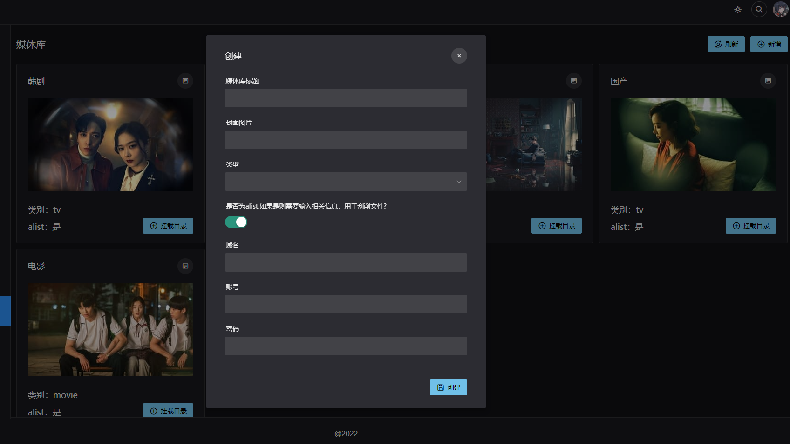

# onelist
一个类似emby的专注于刮削alist聚合网盘形成影视媒体库的程序。


## 1.程序下载
可以在github发布页下载已经编译好的二进制文件

使用前必看，程序采用themoviedb作为刮削的资源库，推荐使用国外主机，否则你需要修改hosts文件。
```
99.84.251.12 api.themoviedb.org
99.84.251.19 api.themoviedb.org
99.84.251.67 api.themoviedb.org
99.84.251.108 api.themoviedb.org
156.146.56.162 image.tmdb.org
108.138.246.49 image.tmdb.org
```
## 2.下载后先初始化配置文件

输入`./onelist -run config`命令,便会生成配置文件config.env
修改完config.env配置文件后,运行`onelist -run server`便可启动项目,运行`onelist -run admin`可查看管理员账户!

config.env
```
# 服务设置
# 注意要改为未被占用的端口
API_PORT=5245
FaviconicoUrl=https://wework.qpic.cn/wwpic/818353_fizV30xbQCGPQRP_1677394564/0
API_SECRET=fRVvjcNd11gYGI85StVaeCtPVSmJTRRE

# Env有两种模式，Debug及Release，主要用在数据库为mysql时候，需要注意修改Env环境和mysql密码对应
Env=Debug

# 管理员账户设置，用于初始化管理员账户
UserEmail=xxxx.@qq.com
UserPassword=xxxxx

# 数据库设置
DB_DRIVER=sqlite
DB_USER=root
DbName=onelist

# 如果上面DB_DRIVER类型为mysql，就需要正确填下以下参数
DB_PASSWORD_Debug=123456
DB_PASSWORD_Release=123456

# TheMovieDb Key
# 在https://www.themoviedb.org网站申请
KeyDb=22f10ca52f109158ac7fe064ebbcf697
```
## 3.运行程序

```
# 先运行，查看有无错误
./onelist -run server

注意：如果提示权限问题，可以先授权文件chmod 777 onelist

# 如果想后台一直保持运行，可用以下命令
nohup ./onelist -run server >/dev/null 2>&1 &
```
## 4.登录
访问你的`ip:端口`就可以进入管理后台了(记得防火墙放行该端口)
## 5.添加媒体库


1.对应输入媒体库名字，比如电影，类型选择movie

2.封面图片可以暂时不填

3.填写alist相关信息，这个主要用于程序查询你alist中文件，根据文件名进行刮削

## 6.挂载资源，新建完毕后，添加挂载目录。


挂载的目录中文件必须满足下面这种命名方式
```
电影就按电影名称

电视同一部美剧，所有季可以分开或者放在不同子目录，但是文件名一定得满足以下格式
权力的游戏S01E01.mp4
权力的游戏S01E02.mp4
权力的游戏S01E03.mp4
```
填写比如`/阿里2号/电影01组`即可，可以选择是否自动刮削，用于你网盘有新文件，程序自动给你添加进影库,

点击创建后反应比较慢，是因为程序去遍历你的alist文件了，稍微等下

> 注意：添加挂载目录只能选择你建立媒体库中采用的alist相关目录，要与alist域名一致
>
## 7.创建后点击刷新就可以看到刮削进度了

可以进入错误文件中查看
